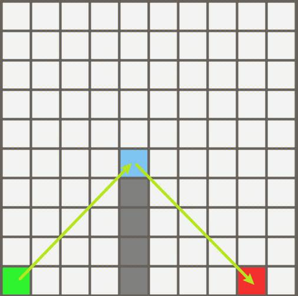
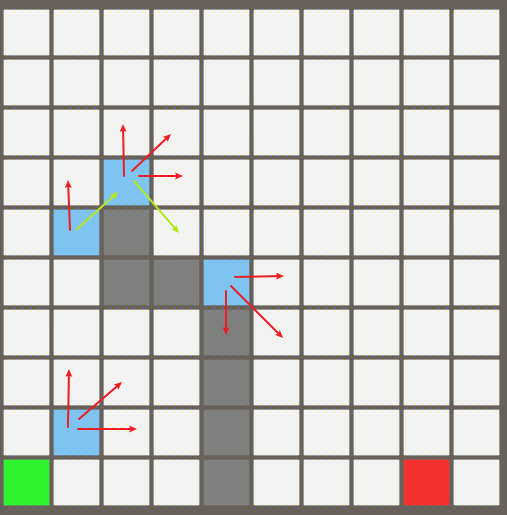

# JPS寻路算法实现

## 1.简介

JPS(Jump Point Search)寻路算法，也称跳点搜索算法，是一种A* 算法的优化算法，在大部分情况下性能提升都极为明显（如果地图上障碍极少且较为简单，则更加适合A* 算法）。其主要适用于2D网格的寻路，但个人认为经过改造后依然可以适配3D网格的搜索（毕竟A*可以改造为3D）。


A*算法的大部分消耗来源于需要对路径上的大量节点进行评估和择优，JPS只需要找到最关键的部分节点（跳点）进行比较，达到更高的性能。


JPS算法的实现与原理网上已有多篇文章或视频详解，本文在此不会作过多赘述，可参考资料如下：

[PathFinding.js](https://qiao.github.io/PathFinding.js/visual/)

[《JPS跳点搜索算法》比A*算法快百倍的JPS寻路算法是如何实现的_哔哩哔哩_bilibili](https://www.bilibili.com/video/BV18z421i7s8/?spm_id_from=333.788.recommend_more_video.0&vd_source=cc44bfa9e285b4f562d9b89c0f327ce6)

[最快速的寻路算法 Jump Point Search - 知乎](https://zhuanlan.zhihu.com/p/290924212?utm_source=ZHShareTargetIDMore&utm_medium=social&utm_oi=781889702075564032)

[游戏开发技术杂谈8：JPS寻路算法 - 知乎](https://zhuanlan.zhihu.com/p/500807732)

[游戏中寻路算法简单介绍 - 知乎](https://zhuanlan.zhihu.com/p/660532357)

[【Unity】保姆级JPS寻路算法_哔哩哔哩_bilibili](https://www.bilibili.com/video/BV1zKBhY9ES7/?spm_id_from=333.337.search-card.all.click&vd_source=cc44bfa9e285b4f562d9b89c0f327ce6)

[2.3JPS算法_哔哩哔哩_bilibili](https://www.bilibili.com/video/BV19t4y1x7Nk/?spm_id_from=333.788.comment.all.click&vd_source=cc44bfa9e285b4f562d9b89c0f327ce6)


<font color="red">**JPS的寻路流程就相当于直线/斜线移动一根筋移动，直到到达跳点（拐点），改变方向，继续直线/斜线一根筋移动，如此循环直到到达终点。**</font>


按这句话通俗理解了JPS算法，我们就对其定义和规则的制订有了一个直接的认知，能更好地理解定义和规则的目的，而不是只看其字面意思陷入枯燥的文字理解中。

## 2.重要概念

### 2.1 两个定义

定义一：强迫邻居

如果节点 n 是 x 的邻居，并且节点 n 的邻居有阻挡（不可行走的格子），并且从 parent(x)、x、n 的路径长度比其他任何从 parent(x)到 n 且不经过 x 的路径短，其中 parent(x)为路径中 x 的前一个点，则 n 为 x 的强迫邻居，x 为 n 的跳点。示例图如下：


   


<font color="red">**简单来说，X其实就是从Parent(X)到N的最短路线的必经节点。**</font>


定义二：跳点

- 起点或终点均为跳点

- 若X有强迫邻居，则X为跳点

- 若Parent(X)到X为对角线移动，且X可以经过直线移动（水平或垂直）到达一个跳点，则X是跳点


<font color="red">**简单来说，跳点就是改变行走方向的拐点。**</font>

### 2.2 三个规则

- 规则一：JPS 搜索跳点的过程中，如果直线方向、对角线方向都可以移动，则首先在直线方向搜索跳点，再在对角线方向搜索跳点。

- 规则二：

    - 如果从 parent(x)到 x 是直线移动，n 是 x 的邻居，若有从 parent(x)到 n 的路径不经过 x 且路径长度小于或等于从 parent(x)经过 x 到 n 的路径，则走到 x 后下一个点不会走到 n。

    - 如果从 parent(x)到 x 是对角线移动，n 是 x 的邻居，若有从 parent(x)到 n 的路径不经过 x 且路径长度小于从 parent(x)经过 x 到 n 的路径，则走到 x 后下一个点不会走到 n。

- 规则三：只有跳点才会加入 openset，因为跳点会改变行走方向，而非跳点不会改变行走方向，最后寻找出来的路径点也都是跳点。

## 3.寻路过程

1.获取起点S和终点E
2.从起点S向上下左右四个方向直线移动，如果遇到跳点，则将跳点直接加入跳点表，
   跳点方向由前进方向和强制邻居方向共同决定
3.从起点S向左上、右上、左下、右下四个角点方向斜线移动，每次移动一格，移动之后记当前
   位置为parent，接着向角点方向的分量方向循环探索（右上的分量方向是右和上）
   如果向右或者向上或者移动到当前位置时，三者有一者发现了跳点，则记录当前点parent为跳点，加入跳点表
   方向由当前前进方向（比如之前是右上就还是右上）和强制邻居共同决定。
4.只要跳点表不为空
   取出一个损耗最低的跳点，如果跳点为终点，退出循环
   将跳点按照给定的方向循环检测。
补充：起点S和终点E均可以被视为跳点（但真实检测的时候往往不会检测起点）

## 4.已有实现

本文上述所列资料的实现中，以寻路结果为分类分为两类：

- 可以斜向移动，可以斜向穿过障碍物

 

- 只能直线移动，不可斜向穿过障碍物

 

以上两类均在[PathFinding.js](https://qiao.github.io/PathFinding.js/visual/)有实现。

但是，腾讯技术工程在知乎上的文章[(99+ 封私信 / 82 条消息) 最快速的寻路算法 Jump Point Search - 知乎](https://zhuanlan.zhihu.com/p/290924212?utm_source=ZHShareTargetIDMore&utm_medium=social&utm_oi=781889702075564032)中，其寻路结果却是第三类：

- 可以斜向移动，且不可斜向穿过障碍物


个人没有收集到能实现此种特性的JPS算法实现，因此，在实现了常规的JPS算法后，以实现第三类效果为目标，最终成功实现。


## 5.具体实现

首先对比常规的<span style="background-color:yellow;">可以斜向移动，可以斜向穿过障碍物</span>的JPS算法和我们实现的<span style="background-color:yellow;">可以斜向移动，且不可斜向穿过障碍物</span>JPS算法。

之后为了方便书写，我们将前者称为A算法，后者称为B算法。

举例一：


举例二：



*上图中绿色为起点，红色为终点，蓝色为跳点


可以看到，两者最大的不同就是跳点不同，而跳点又是由强迫邻居而来，也就是说，两者强迫邻居的定义也不同。


A算法中，强迫邻居的定义举例如下：

- 直线移动，面朝移动方向，当前节点的左/右节点为障碍，其左前/右前节点不为障碍，则左前/右前节点为强迫邻居。（包含水平移动和竖直移动两种情况，因此使用“面朝移动方向”这一表述）。

 

- 斜向移动，检查构成该移动路线“内拐角”的两个邻居点（内拐角点为当前节点水平/竖直方向分量的反方向节点，图上为两个绿框）。如果其中一个邻居点是障碍，则检查从该障碍点出发，沿着对角线移动的另一个分量方向（水平或垂直）的格子是否可走。如果可走，则该格子就是强迫邻居。

 

在A算法的以上两个情况中（也是全部情况了），当前节点（X节点）均为跳点，跳点为改变移动方向的点，因此，A算法可以在跳点遇到障碍时斜向移动，倘若我们需要禁止遇到障碍时斜向移动，则需要改变强迫邻居的定义来改变跳点的位置。

牢牢抓住跳点为改变移动方向的点这一概念，在刚刚的例子中，我们可以看出B算法的跳点应该是这个点（粉色点），强迫邻居依然还是N点，而对于斜线移动，其实已经被禁止了。

 


B算法中，强迫邻居的定义举例如下:

- 直线移动，面朝移动方向，检查父节点（上一步的格子P）的左右两侧是否存在障碍物。如果父节点的左侧（或右侧）为障碍，但当前节点在同一侧的邻居为通路，那么这个通路邻居就成为当前节点的强迫邻居。

 

- 斜向移动，遇到障碍时禁止斜向移动，强迫邻居只有直线移动才会产生。


两者参考代码如下：

- A算法强迫邻居判断
```C#
private bool HasForcedNeighborCanDiagonal(JPSNode node, int dx, int dy)
{
      // 对角线移动
      if (dx != 0 && dy != 0)
      {
          // 检查条件：左边有墙，且左上可走 or 下边有墙，且右下可走
          if (!IsWalkable(node.x - dx, node.y) && IsWalkable(node.x - dx, node.y + dy)) return true;
          if (!IsWalkable(node.x, node.y - dy) && IsWalkable(node.x + dx, node.y - dy)) return true;
      }
      // 直线移动
      else
      {
          // 水平移动
          if (dx != 0)
          {
              // 上方有墙，且右/左上可走
              if (!IsWalkable(node.x, node.y + 1) && IsWalkable(node.x + dx, node.y + 1)) return true;
              // 下方有墙，且右/左下可走
              if (!IsWalkable(node.x, node.y - 1) && IsWalkable(node.x + dx, node.y - 1)) return true;
          }
          // 竖直移动
          else
          {
              // 右边有墙，且右上/下可走
              if (!IsWalkable(node.x + 1, node.y) && IsWalkable(node.x + 1, node.y + dy)) return true;
              // 左边有墙，且左上/下可走
              if (!IsWalkable(node.x - 1, node.y) && IsWalkable(node.x - 1, node.y + dy)) return true;
          }
      }
            
      return false;
}
```

- B算法强迫邻居判断
```C#
private bool HasForcedNeighborOnlyStraight(JPSNode node, int dx, int dy)
{
        // 对角线移动
        if (dx != 0 && dy != 0)
        {
            return false;
        }
        // 直线移动
        else
        {
            // 水平移动
            if (dx != 0)
            {
                // 左下有墙，且下可走
                if (!IsWalkable(node.x - dx, node.y - 1) && IsWalkable(node.x, node.y - 1)) return true;
                // 左上有墙，且上可走
                if (!IsWalkable(node.x - dx, node.y + 1) && IsWalkable(node.x, node.y + 1)) return true;
            }
            // 竖直移动
            else
            {
                // 右下有墙，且右可走
                if (!IsWalkable(node.x + 1, node.y - dy) && IsWalkable(node.x + 1, node.y)) return true;
                // 左下有墙，且左可走
                if (!IsWalkable(node.x - 1, node.y - dy) && IsWalkable(node.x - 1, node.y)) return true;
            }
        }
            
        return false;
}
```


由于我们改变了强迫邻居、跳点，那么自然也要改变从跳点出发获取的探索方向，同样，我们将A算法与B算法的这一部分进行比较。


A算法中，从跳点出发获取探索方向逻辑如下：

- 若为起点，则8个方向均需要探索（4个直线方向在先，4个斜线方向在后）

- 若为直线移动：

    - 继续探索刚刚的直线方向

    - 探索产生了强迫邻居的方向

- 若为斜向移动：

    - 探索斜向方向的水平分量方向

    - 探索斜向方向的竖直分量方向

    - 继续探索刚刚的斜向方向

    - 探索产生了强迫邻居的方向

 

举例说明，此图中除起点和终点外的跳点的探索方向如图所示，红色箭头为原生需要探索的方向，绿色为强迫邻居的方向。（记得跳点都是由上一个跳点直接直线/斜线跳过来的）


B算法中，从跳点出发获取探索方向逻辑如下：

- 若为起点，则8个方向均需要探索（4个直线方向在先，4个斜线方向在后）。

- 若为直线移动：

    - 继续探索刚刚的直线方向

    - 探索产生了强迫邻居的方向

    - 探索刚刚的直线方向和强迫邻居方向合成的斜向方向（强迫邻居方向在B算法中一定是直线的）

- 若为斜向移动：

    - 探索斜向方向的水平分量方向

    - 探索斜向方向的竖直分量方向

    - 继续探索刚刚的斜向方向

B算法探索斜向移动方向时，均需要保证斜向移动不会碰到障碍物。

 

举例说明，此图中除起点和终点外的跳点的探索方向如图所示，红色箭头为原生需要探索的方向，绿色为强迫邻居的方向。蓝色为刚刚的直线方向和强迫邻居方向合成的斜向方向。


两者参考代码如下：

- A算法从跳点出发获取探索方向
```C#
        private List<Vector2Int> GetExplorationDirectionsCanDiagonal(JPSNode node)
        {
            var explorationDirections = new List<Vector2Int>();
            
            // 如果是起点，8个方向都要探索
            if (node.parent == null)
            {
                // 先直线，再对角线
                explorationDirections.Add(new Vector2Int(0, 1));
                explorationDirections.Add(new Vector2Int(1, 0));
                explorationDirections.Add(new Vector2Int(0, -1));
                explorationDirections.Add(new Vector2Int(-1, 0));
                
                explorationDirections.Add(new Vector2Int(1, 1));
                explorationDirections.Add(new Vector2Int(1, -1));
                explorationDirections.Add(new Vector2Int(-1, -1));
                explorationDirections.Add(new Vector2Int(-1, 1));

                return explorationDirections;
            }
            
            // 如果不是起点，则根据父节点的位置，剪枝邻居
            var parent = node.parent;
            
            int dx = Mathf.Clamp(node.x - parent.x, -1, 1);
            int dy = Mathf.Clamp(node.y - parent.y, -1, 1);
            
            // 若为直线移动
            if (dx == 0 || dy == 0)
            {
                // 继续探索刚刚的直线方向
                if (IsWalkable(node.x + dx, node.y + dy))
                    explorationDirections.Add(new Vector2Int(dx, dy));
                
                // 检查产生了强迫邻居的方向
                if (!IsWalkable(node.x, node.y + 1) && IsWalkable(node.x + dx, node.y + 1) && dy == 0) 
                    explorationDirections.Add(new Vector2Int(dx, 1));
                if (!IsWalkable(node.x, node.y - 1) && IsWalkable(node.x + dx, node.y - 1) && dy == 0) 
                    explorationDirections.Add(new Vector2Int(dx, -1));
                if (!IsWalkable(node.x + 1, node.y) && IsWalkable(node.x + 1, node.y + dy) && dx == 0)
                    explorationDirections.Add(new Vector2Int(1, dy));
                if (!IsWalkable(node.x - 1, node.y) && IsWalkable(node.x - 1, node.y + dy) && dx == 0) 
                    explorationDirections.Add(new Vector2Int(-1, dy));
            }
            // 若为对角线移动，添加三个方向
            else
            {
                // 探索对角线的x分量方向
                if (IsWalkable(node.x + dx, node.y))
                    explorationDirections.Add(new Vector2Int(dx, 0));
                // 探索对角线的y分量方向
                if (IsWalkable(node.x, node.y + dy))
                    explorationDirections.Add(new Vector2Int(0, dy));
                
                // 继续探索对角线方向
                if (IsWalkable(node.x + dx, node.y + dy)) 
                    explorationDirections.Add(new Vector2Int(dx, dy));
                
                if (!IsWalkable(node.x - dx, node.y) && IsWalkable(node.x - dx, node.y + dy))
                    explorationDirections.Add(new Vector2Int(-dx, dy));
                if (!IsWalkable(node.x, node.y - dy) && IsWalkable(node.x + dx, node.y - dy))
                    explorationDirections.Add(new Vector2Int(dx, -dy));
            }
            
            return explorationDirections;
        }
```

- B算法从跳点出发获取探索方向（需要保证斜向移动不会碰到障碍物）
```C#
		private List<Vector2Int> GetExplorationDirectionsOnlyStraight(JPSNode node)
        {
            var explorationDirections = new List<Vector2Int>();
            
            // 如果是起点，8个方向都要探索
            if (node.parent == null)
            {
                // 先直线，再对角线
                explorationDirections.Add(new Vector2Int(0, 1));
                explorationDirections.Add(new Vector2Int(1, 0));
                explorationDirections.Add(new Vector2Int(0, -1));
                explorationDirections.Add(new Vector2Int(-1, 0));
                
                if (CanWalkTo(node.x, node.y, node.x + 1, node.y + 1))
                    explorationDirections.Add(new Vector2Int(1, 1));
                if (CanWalkTo(node.x, node.y, node.x + 1, node.y - 1))
                    explorationDirections.Add(new Vector2Int(1, -1));
                if (CanWalkTo(node.x, node.y, node.x - 1, node.y - 1))
                    explorationDirections.Add(new Vector2Int(-1, -1));
                if (CanWalkTo(node.x, node.y, node.x - 1, node.y + 1))
                    explorationDirections.Add(new Vector2Int(-1, 1));

                return explorationDirections;
            }
            
            // 如果不是起点，则根据父节点的位置，剪枝邻居
            var parent = node.parent;
            
            int dx = Mathf.Clamp(node.x - parent.x, -1, 1);
            int dy = Mathf.Clamp(node.y - parent.y, -1, 1);
            
            // 若为直线移动
            if (dx == 0 || dy == 0)
            {
                // 继续探索刚刚的直线方向
                if (IsWalkable(node.x + dx, node.y + dy))
                    explorationDirections.Add(new Vector2Int(dx, dy));
                
                // 检查产生了强迫邻居的方向
                // 水平移动
                if (!IsWalkable(node.x - dx, node.y + 1) && IsWalkable(node.x, node.y + 1) && dy == 0)
                {
                    explorationDirections.Add(new Vector2Int(0, 1));
                    if (CanWalkTo(node.x, node.y, node.x + dx, node.y + 1))
                        explorationDirections.Add(new Vector2Int(dx, 1));
                }
                if (!IsWalkable(node.x - dx, node.y - 1) && IsWalkable(node.x, node.y - 1) && dy == 0)
                {
                    explorationDirections.Add(new Vector2Int(0, -1));
                    if (CanWalkTo(node.x, node.y, node.x + dx, node.y - 1))
                        explorationDirections.Add(new Vector2Int(dx, -1));
                }
                // 竖直移动
                if (!IsWalkable(node.x + 1, node.y - dy) && IsWalkable(node.x + 1, node.y) && dx == 0)
                {
                    explorationDirections.Add(new Vector2Int(1, 0));
                    if (CanWalkTo(node.x, node.y, node.x + 1, node.y + dy))
                        explorationDirections.Add(new Vector2Int(1, dy));
                }
                if (!IsWalkable(node.x - 1, node.y - dy) && IsWalkable(node.x - 1, node.y) && dx == 0)
                {
                    explorationDirections.Add(new Vector2Int(-1, 0));
                    if (CanWalkTo(node.x, node.y, node.x - 1, node.y + dy))
                        explorationDirections.Add(new Vector2Int(-1, dy));
                }
            }
            // 若为对角线移动，添加三个方向
            else
            {
                // 探索对角线的x分量方向
                if (IsWalkable(node.x + dx, node.y))
                    explorationDirections.Add(new Vector2Int(dx, 0));
                // 探索对角线的y分量方向
                if (IsWalkable(node.x, node.y + dy))
                    explorationDirections.Add(new Vector2Int(0, dy));
                
                // 继续探索对角线方向
                if (IsWalkable(node.x, node.y + dy) || IsWalkable(node.x + dx, node.y)) {
                    if (CanWalkTo(node.x, node.y, node.x + dx, node.y + dy)) 
                        explorationDirections.Add(new Vector2Int(dx, dy));
                }
            }
            
            return explorationDirections;
        }

		private bool CanWalkTo(int curX, int curY, int nextX, int nextY)
        {
            if (!IsWalkable(nextX, nextY))
                return false;
            
            int dx = nextX - curX;
            int dy = nextY - curY;
            if (dx != 0 && dy != 0)
            {
                // 必须检查两个拐角方向的节点是否都可走
                if (!IsWalkable(curX + dx, curY) || !IsWalkable(curX, curY + dy))
                {
                    return false;
                }
            }
            return true;
        }
```

在其余实现上，两个算法没有其他任何区别了，总结一下，我们只需要更改判断强迫邻居的函数，以及获取探索方向的函数，即可无缝切换A、B算法，实现角度来讲还是比较优美的。


最后，附上整个实现的源代码，可以接入自己的可视化方法进行查看。其中，A算法、B算法的切换用宏包裹，不注释宏`ONLY_STRAIGHT`即为B算法，否则为A算法。

```C#
#define ONLY_STRAIGHT // 仅可直线移动，在无障碍时可以斜向移动

using System.Collections.Generic;
using UnityEngine;
using Utility;

namespace JPS
{
    public class JPSManager : IPathfindingManager
    {
        private static JPSManager instance;

        public static JPSManager Instance
        {
            get
            {
                if (instance == null)
                {
                    instance = new JPSManager();
                }

                return instance;
            }
        }

        #region IPathfindingManager接口实现

        PathNodeBase[,] IPathfindingManager.nodesMap => nodesMap;
        HashSet<PathNodeBase> IPathfindingManager.closedList => new HashSet<PathNodeBase>(closedList);

        List<PathNodeBase> IPathfindingManager.FindPath(int startX, int startY, int endX, int endY)
        {
            var result = FindPath(startX, startY, endX, endY);
            return result == null ? null : new List<PathNodeBase>(result);
        }

        void IPathfindingManager.InitMap(int width, int height, int obstacleCount) =>
            InitMap(width, height, obstacleCount);

        #endregion

        private int width;
        private int height;

        public JPSNode[,] nodesMap;
        
        private JPSNode endNode;

        public PriorityQueue<JPSNode> openList = new PriorityQueue<JPSNode>();
        public HashSet<JPSNode> closedList = new HashSet<JPSNode>();

        public void InitMap(int width, int height, int obstacleCount)
        {
            this.width = width;
            this.height = height;
            nodesMap = new JPSNode[width, height];
            for (int i = 0; i < width; i++)
            {
                for (int j = 0; j < height; j++)
                {
                    nodesMap[i, j] = new JPSNode(i, j, NodeType.Open);
                }
            }

            for (int i = 0; i < obstacleCount; i++)
            {
                int x = Random.Range(0, width);
                int y = Random.Range(0, height);
                nodesMap[x, y].nodeType = NodeType.Obstacle;
            }
        }
        
        public bool IsInMap(JPSNode node)
        {
            return IsInMap(node.x, node.y);
        }
        
        public bool IsInMap(int x, int y)
        {
            return x >= 0 && x < width && y >= 0 && y < height;
        }
        
        public List<JPSNode> FindPath(JPSNode startNode, JPSNode endNode)
        {
            return FindPath(startNode.x, startNode.y, endNode.x, endNode.y);
        }

        public List<JPSNode> FindPath(int startX, int startY, int endX, int endY)
        {
            openList.Clear();
            closedList.Clear();

            // 新增：重置所有节点的gCost、hCost、fCost和parent，防止多次寻路状态残留
            for (int i = 0; i < width; i++)
            {
                for (int j = 0; j < height; j++)
                {
                    var node = nodesMap[i, j];
                    node.gCost = float.MaxValue;
                    node.hCost = 0;
                    node.fCost = 0;
                    node.parent = null;
                }
            }
            
            var startNode = nodesMap[startX, startY];
            this.endNode = nodesMap[endX, endY];

            if (startNode.nodeType == NodeType.Obstacle || endNode.nodeType == NodeType.Obstacle) return null;
            if (!IsInMap(startX, startY) || !IsInMap(endX, endY)) return null;
            
            startNode.gCost = 0;
            startNode.hCost = CalculateDiagonalHCost(startNode, endNode);
            startNode.fCost = startNode.gCost + startNode.hCost;
            startNode.parent = null;
            
            openList.Enqueue(startNode);

            while (openList.Count > 0)
            {
                var currentNode = openList.Dequeue();
                closedList.Add(currentNode);

                if (currentNode == endNode)
                {
                    return ReconstructPath(endNode);
                }
                
                FindJumpPoints(currentNode);
            }
            
            return null;
        }

        /// <summary>
        /// 识别跳点，并将其加入openList
        /// </summary>
        /// <param name="currentNode"></param>
        private void FindJumpPoints(JPSNode currentNode)
        {
#if ONLY_STRAIGHT
            var explorationDirections = GetExplorationDirectionsOnlyStraight(currentNode);
#else
            var explorationDirections = GetExplorationDirectionsCanDiagonal(currentNode);
#endif
            foreach (var direction in explorationDirections)
            {
                // 从当前节点，沿着特定方向跳跃，寻找跳点
                JPSNode jumpPoint = Jump(currentNode, direction.x, direction.y);

                if (jumpPoint != null)
                {
                    // 跳过已经在关闭列表的节点（A*流程）
                    if (closedList.Contains(jumpPoint))
                        continue;
                    
                    // G值是两跳点间的直线距离
                    float newGCost = currentNode.gCost + GetDistance(currentNode, jumpPoint);
                    if (newGCost < jumpPoint.gCost)
                    {
                        jumpPoint.gCost = newGCost;
                        jumpPoint.hCost = CalculateDiagonalHCost(jumpPoint, endNode);
                        jumpPoint.fCost = jumpPoint.gCost + jumpPoint.hCost;
                        jumpPoint.parent = currentNode;
                        
                        openList.Enqueue(jumpPoint);
                    }
                    
                }
            }
        }
        
        private float GetDistance(JPSNode a, JPSNode b) // JPS用对角线距离更优
        {
            return Mathf.Sqrt(Mathf.Pow(a.x - b.x, 2) + Mathf.Pow(a.y - b.y, 2));
        }

        /// <summary>
        /// 跳跃函数
        /// </summary>
        /// <param name="currentNode"></param>
        /// <param name="direction"></param>
        /// <returns></returns>
        private JPSNode Jump(JPSNode currentNode, int dx, int dy)
        {
            int nextX = currentNode.x + dx;
            int nextY = currentNode.y + dy;

            // 越界或撞墙，此方向跳跃失败
            if (!IsInMap(nextX, nextY) || nodesMap[nextX, nextY].nodeType == NodeType.Obstacle)
            {
                return null;
            }
            
            // 这个注释里的是之前的错误认知，是多余的
// #if ONLY_STRAIGHT
//             // 不能穿过斜向的障碍
//             if (!CanWalkTo(currentNode.x, currentNode.y, nextX, nextY))
//             {
//                 return null;
//             }
// #endif
            
            // 斜向不可穿过两个障碍中间
            if (dx != 0 && dy != 0)
            {
                if (!IsWalkable(currentNode.x + dx, currentNode.y) && !IsWalkable(currentNode.x, currentNode.y + dy))
                {
                    return null;
                }
            }

            JPSNode nextNode = nodesMap[nextX, nextY];

            // 1. 如果是终点，则找到了一个跳点
            if (nextNode == endNode)
            {
                return nextNode;
            }

#if ONLY_STRAIGHT
            // 2. 检查强迫邻居，如果存在，则当前节点是一个跳点
            if (HasForcedNeighborOnlyStraight(nextNode, dx, dy))
            {
                return nextNode;
            }
#else
            if (HasForcedNeighborCanDiagonal(nextNode, dx, dy))
            {
                return nextNode;
            }
#endif

            // 3. 对角线移动的额外规则
            if (dx != 0 && dy != 0)
            {
                // 从对角线节点出发，进行水平和垂直的跳跃
                // 如果能找到跳点，则当前对角线节点也是跳点
                if (Jump(nextNode, dx, 0) != null || Jump(nextNode, 0, dy) != null)
                {
                    return nextNode;
                }
            }

            // 如果以上都不是，则继续沿着当前方向递归跳跃
            return Jump(nextNode, dx, dy);
        }
        
        
        
        /// <summary>
        /// 根据父节点（上一步）怎么到达当前节点，剪枝邻居，获取需要的探索方向
        /// </summary>
        /// <param name="node"></param>
        /// <returns></returns>
        private List<Vector2Int> GetExplorationDirectionsCanDiagonal(JPSNode node)
        {
            var explorationDirections = new List<Vector2Int>();
            
            // 如果是起点，8个方向都要探索
            if (node.parent == null)
            {
                // 先直线，再对角线
                explorationDirections.Add(new Vector2Int(0, 1));
                explorationDirections.Add(new Vector2Int(1, 0));
                explorationDirections.Add(new Vector2Int(0, -1));
                explorationDirections.Add(new Vector2Int(-1, 0));
                
                explorationDirections.Add(new Vector2Int(1, 1));
                explorationDirections.Add(new Vector2Int(1, -1));
                explorationDirections.Add(new Vector2Int(-1, -1));
                explorationDirections.Add(new Vector2Int(-1, 1));

                return explorationDirections;
            }
            
            // 如果不是起点，则根据父节点的位置，剪枝邻居
            var parent = node.parent;
            
            int dx = Mathf.Clamp(node.x - parent.x, -1, 1);
            int dy = Mathf.Clamp(node.y - parent.y, -1, 1);
            
            // 若为直线移动
            if (dx == 0 || dy == 0)
            {
                // 继续探索刚刚的直线方向
                if (IsWalkable(node.x + dx, node.y + dy))
                    explorationDirections.Add(new Vector2Int(dx, dy));
                
                // 检查产生了强迫邻居的方向
                if (!IsWalkable(node.x, node.y + 1) && IsWalkable(node.x + dx, node.y + 1) && dy == 0) 
                    explorationDirections.Add(new Vector2Int(dx, 1));
                if (!IsWalkable(node.x, node.y - 1) && IsWalkable(node.x + dx, node.y - 1) && dy == 0) 
                    explorationDirections.Add(new Vector2Int(dx, -1));
                if (!IsWalkable(node.x + 1, node.y) && IsWalkable(node.x + 1, node.y + dy) && dx == 0)
                    explorationDirections.Add(new Vector2Int(1, dy));
                if (!IsWalkable(node.x - 1, node.y) && IsWalkable(node.x - 1, node.y + dy) && dx == 0) 
                    explorationDirections.Add(new Vector2Int(-1, dy));
            }
            // 若为对角线移动，添加三个方向
            else
            {
                // 探索对角线的x分量方向
                if (IsWalkable(node.x + dx, node.y))
                    explorationDirections.Add(new Vector2Int(dx, 0));
                // 探索对角线的y分量方向
                if (IsWalkable(node.x, node.y + dy))
                    explorationDirections.Add(new Vector2Int(0, dy));
                
                // 继续探索对角线方向
                if (IsWalkable(node.x + dx, node.y + dy)) 
                    explorationDirections.Add(new Vector2Int(dx, dy));
                
                if (!IsWalkable(node.x - dx, node.y) && IsWalkable(node.x - dx, node.y + dy))
                    explorationDirections.Add(new Vector2Int(-dx, dy));
                if (!IsWalkable(node.x, node.y - dy) && IsWalkable(node.x + dx, node.y - dy))
                    explorationDirections.Add(new Vector2Int(dx, -dy));
            }
            
            return explorationDirections;
        }
        
        private List<Vector2Int> GetExplorationDirectionsOnlyStraight(JPSNode node)
        {
            var explorationDirections = new List<Vector2Int>();
            
            // 如果是起点，8个方向都要探索
            if (node.parent == null)
            {
                // 先直线，再对角线
                explorationDirections.Add(new Vector2Int(0, 1));
                explorationDirections.Add(new Vector2Int(1, 0));
                explorationDirections.Add(new Vector2Int(0, -1));
                explorationDirections.Add(new Vector2Int(-1, 0));
                
                if (CanWalkTo(node.x, node.y, node.x + 1, node.y + 1))
                    explorationDirections.Add(new Vector2Int(1, 1));
                if (CanWalkTo(node.x, node.y, node.x + 1, node.y - 1))
                    explorationDirections.Add(new Vector2Int(1, -1));
                if (CanWalkTo(node.x, node.y, node.x - 1, node.y - 1))
                    explorationDirections.Add(new Vector2Int(-1, -1));
                if (CanWalkTo(node.x, node.y, node.x - 1, node.y + 1))
                    explorationDirections.Add(new Vector2Int(-1, 1));

                return explorationDirections;
            }
            
            // 如果不是起点，则根据父节点的位置，剪枝邻居
            var parent = node.parent;
            
            int dx = Mathf.Clamp(node.x - parent.x, -1, 1);
            int dy = Mathf.Clamp(node.y - parent.y, -1, 1);
            
            // 若为直线移动
            if (dx == 0 || dy == 0)
            {
                // 继续探索刚刚的直线方向
                if (IsWalkable(node.x + dx, node.y + dy))
                    explorationDirections.Add(new Vector2Int(dx, dy));
                
                // 检查产生了强迫邻居的方向
                // 水平移动
                if (!IsWalkable(node.x - dx, node.y + 1) && IsWalkable(node.x, node.y + 1) && dy == 0)
                {
                    explorationDirections.Add(new Vector2Int(0, 1));
                    if (CanWalkTo(node.x, node.y, node.x + dx, node.y + 1))
                        explorationDirections.Add(new Vector2Int(dx, 1));
                }
                if (!IsWalkable(node.x - dx, node.y - 1) && IsWalkable(node.x, node.y - 1) && dy == 0)
                {
                    explorationDirections.Add(new Vector2Int(0, -1));
                    if (CanWalkTo(node.x, node.y, node.x + dx, node.y - 1))
                        explorationDirections.Add(new Vector2Int(dx, -1));
                }
                // 竖直移动
                if (!IsWalkable(node.x + 1, node.y - dy) && IsWalkable(node.x + 1, node.y) && dx == 0)
                {
                    explorationDirections.Add(new Vector2Int(1, 0));
                    if (CanWalkTo(node.x, node.y, node.x + 1, node.y + dy))
                        explorationDirections.Add(new Vector2Int(1, dy));
                }
                if (!IsWalkable(node.x - 1, node.y - dy) && IsWalkable(node.x - 1, node.y) && dx == 0)
                {
                    explorationDirections.Add(new Vector2Int(-1, 0));
                    if (CanWalkTo(node.x, node.y, node.x - 1, node.y + dy))
                        explorationDirections.Add(new Vector2Int(-1, dy));
                }
            }
            // 若为对角线移动，添加三个方向
            else
            {
                // 探索对角线的x分量方向
                if (IsWalkable(node.x + dx, node.y))
                    explorationDirections.Add(new Vector2Int(dx, 0));
                // 探索对角线的y分量方向
                if (IsWalkable(node.x, node.y + dy))
                    explorationDirections.Add(new Vector2Int(0, dy));
                
                // 继续探索对角线方向
                if (IsWalkable(node.x, node.y + dy) || IsWalkable(node.x + dx, node.y)) {
                    if (CanWalkTo(node.x, node.y, node.x + dx, node.y + dy)) 
                        explorationDirections.Add(new Vector2Int(dx, dy));
                }
            }
            
            return explorationDirections;
        }

        private bool HasForcedNeighborCanDiagonal(JPSNode node, int dx, int dy)
        {
            // 对角线移动
            if (dx != 0 && dy != 0)
            {
                // 检查条件：左边有墙，且左上可走 or 下边有墙，且右下可走
                if (!IsWalkable(node.x - dx, node.y) && IsWalkable(node.x - dx, node.y + dy)) return true;
                if (!IsWalkable(node.x, node.y - dy) && IsWalkable(node.x + dx, node.y - dy)) return true;
            }
            // 直线移动
            else
            {
                // 水平移动
                if (dx != 0)
                {
                    // 上方有墙，且右/左上可走
                    if (!IsWalkable(node.x, node.y + 1) && IsWalkable(node.x + dx, node.y + 1)) return true;
                    // 下方有墙，且右/左下可走
                    if (!IsWalkable(node.x, node.y - 1) && IsWalkable(node.x + dx, node.y - 1)) return true;
                }
                // 竖直移动
                else
                {
                    // 右边有墙，且右上/下可走
                    if (!IsWalkable(node.x + 1, node.y) && IsWalkable(node.x + 1, node.y + dy)) return true;
                    // 左边有墙，且左上/下可走
                    if (!IsWalkable(node.x - 1, node.y) && IsWalkable(node.x - 1, node.y + dy)) return true;
                }
            }
            
            return false;
        }

        private bool HasForcedNeighborOnlyStraight(JPSNode node, int dx, int dy)
        {
            // 对角线移动
            if (dx != 0 && dy != 0)
            {
                return false;
            }
            // 直线移动
            else
            {
                // 水平移动
                if (dx != 0)
                {
                    // 左下有墙，且下可走
                    if (!IsWalkable(node.x - dx, node.y - 1) && IsWalkable(node.x, node.y - 1)) return true;
                    // 左上有墙，且上可走
                    if (!IsWalkable(node.x - dx, node.y + 1) && IsWalkable(node.x, node.y + 1)) return true;
                }
                // 竖直移动
                else
                {
                    // 右下有墙，且右可走
                    if (!IsWalkable(node.x + 1, node.y - dy) && IsWalkable(node.x + 1, node.y)) return true;
                    // 左下有墙，且左可走
                    if (!IsWalkable(node.x - 1, node.y - dy) && IsWalkable(node.x - 1, node.y)) return true;
                }
            }
            
            return false;
        }

        /// <summary>
        /// JPS 必须使用特殊的路径回溯方法
        /// </summary>
        /// <param name="endNode"></param>
        /// <returns></returns>
        private List<JPSNode> ReconstructPath(JPSNode endNode)
        {
            var path = new List<JPSNode>();
            var currentNode = endNode;
            while (currentNode != null)
            {
                var parent = currentNode.parent as JPSNode;
                if (parent != null)
                {
                    // 在父子跳点之间，填补中间的直线路径
                    int dx = Mathf.Clamp(currentNode.x - parent.x, -1, 1);
                    int dy = Mathf.Clamp(currentNode.y - parent.y, -1, 1);
                    int currentX = currentNode.x;
                    int currentY = currentNode.y;

                    while (currentX != parent.x || currentY != parent.y)
                    {
                        path.Add(nodesMap[currentX, currentY]);
                        currentX -= dx;
                        currentY -= dy;
                    }
                }
                
                path.Add(currentNode); // 加入自己
                
                currentNode = parent;
            }
            
            path.Reverse();

            return path;
        }

        private bool IsWalkable(int x, int y)
        {
            return IsInMap(x, y) && nodesMap[x, y].nodeType != NodeType.Obstacle;
        }

        private bool CanWalkTo(int curX, int curY, int nextX, int nextY)
        {
            if (!IsWalkable(nextX, nextY))
                return false;
            
            int dx = nextX - curX;
            int dy = nextY - curY;
            if (dx != 0 && dy != 0)
            {
                // 必须检查两个拐角方向的节点是否都可走
                if (!IsWalkable(curX + dx, curY) || !IsWalkable(curX, curY + dy))
                {
                    return false;
                }
            }
            return true;
        }
        
        private float CalculateDiagonalHCost(PathNodeBase startNode, PathNodeBase endNode)
        {
            float dx = Mathf.Abs(startNode.x - endNode.x);
            float dy = Mathf.Abs(startNode.y - endNode.y);
            float D = 1f; // 直线移动代价
            float D2 = Mathf.Sqrt(2); // 对角线移动代价，约1.414
           
            // 公式：D * (dx + dy) + (D2 - 2 * D) * min(dx, dy)
            // 简化后也可以是：D * (max(dx, dy) - min(dx, dy)) + D2 * min(dx, dy)
            return D * Mathf.Abs(dx - dy) + D2 * Mathf.Min(dx, dy);
        }
    }
}
```